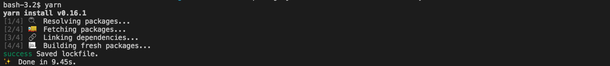
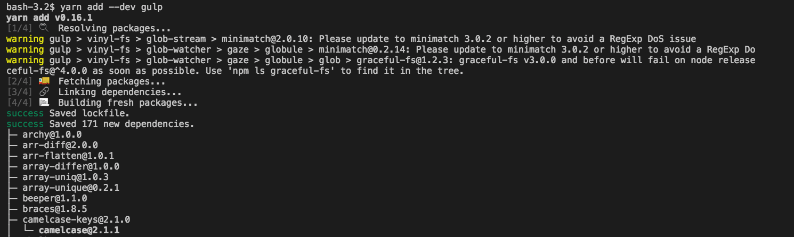
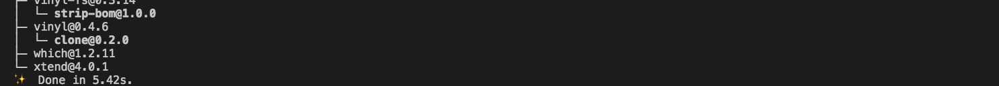
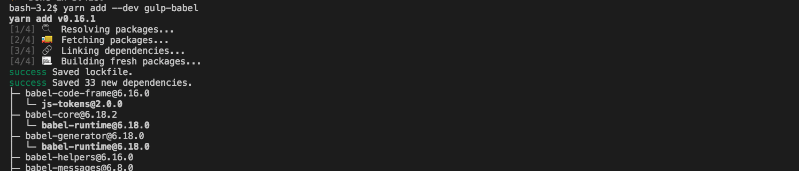
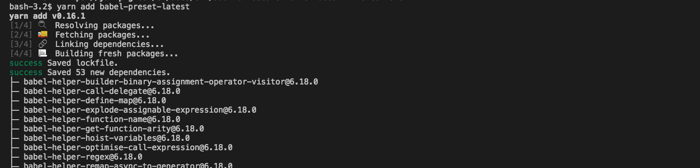
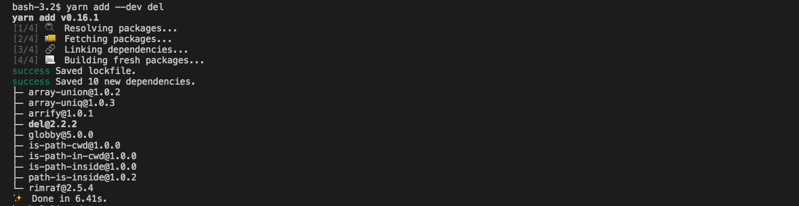
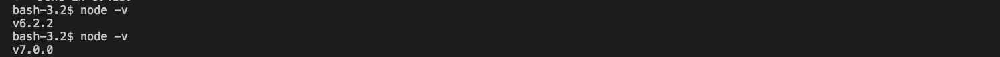
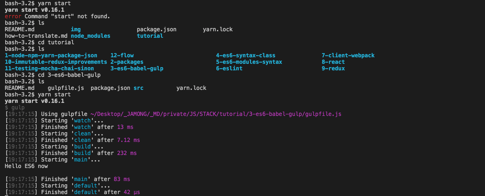

# 3 - Setting up ES6 with Babel and Gulp

우리가 지금부터 쓰려고하는 ES6 syntax는 "오래된" ES5 syntax 를 훌륭하게 개선한 syntax이다.
모든 브라우저나 JS 환경들이 ES5는 잘 이해하고있지만, ES6에 대해서는 그렇지 못하다. 따라서 우리는 ES7 파일을 ES5안으로 transform 하기위해서 'Babel' 이라고 불리는 도구를 사용할 것이다.

Babel을 실행시키기 위해서, 우리는 Gulp(task runner) 를 사용할 것이다. 이것은 `package.json`아래에 있는 `scripts` 파일의 작업과 유사하지만, 당신의 task를 JS 파일에 작성하는 것은 JSON 파일에 작성하는 것보다 간단하고, 명확하다. 따라서 우리는 이제 Gulp를 설치하고, Gulp에서 사용할 Babel 플러그인도 마찬가지로 설치해줄 것이다.

> 아래의 과정을 진행하기 위해서는 `yarn`이라는 패키징매니저가 설치되어있어야한다.

### yarn 설치하기
- [yarn official download page](https://yarnpkg.com/en/docs/install) (for mac, window, rinux, alternatives)
- [yarn 설치 참고글](https://scotch.io/tutorials/yarn-package-manager-an-improvement-over-npm)
- [how Yarn Works](https://scotch.io/tutorials/yarn-package-manager-an-improvement-over-npm#how-yarn-works)


```
npm install -g yarn
```


`Yarn`이 `npm`을 replace 할 것이라는 걱정은 하지 않아도 된다.  
-  `npm`을 '대체'한다기보다 '개선'한다.  
  - __`yarn`은 `npm`에서와 마찬가지로 다음과 같은 환경을 갖는다.__ 
    -  `package.json`파일을 사용한다.
    -  `node_modules`폴더에 dependencies를 저장한다.

> 이해가 필요하다면 how yarn works 을 추가로 정리해볼 필요가 있다.


## tutorial로 돌아가기 
- Run `yarn add --dev gulp`
- Run `yarn add --dev gulp-babel`
- Run `yarn add --dev babel-preset-latest`
- Run `yarn add --dev del` (for the `clean` task, as you will see below)
- babel configuration을 위해, `package.json`안에 `babel` 필드를 추가한다. 다음과 같은 최신 Babel preset의 형태로 한다.

```json
"babel": {
  "presets": [
    "latest"
  ]
},
```

> 이걸 하려고 `package.json`을 열어보았더니, 이미 있다.!


**Note**: `package.json`파일 대신 `.babelrc`파일을 당신의 프로젝트의 roote level에서 사용할 수 있다. 당신의 root 폴더는 아마 시간이 지나면 지날 수록 부풀어(bloated) 오를 것이다. 따라서, `package.json`안의 Babel config를 이것이 매우 커질 때 까지 유지해야한다.

- `index.js` 파일을 새로운 `src` 폴더로 옮긴다. 이곳은 우리의 ES6 코드들을 작성하게될 공간이다.  `lib` 폴더는 컴파일 된 ES5 코드가 가게 될 공간이다. Gulp와 Babel이 이것을 생성하는 작업을 처리할 것이다.
- `index.js`파일에서 `color` 이전의 관련 코드를 제거한다. 그리고 다음의 심플한 코드로 대체한다.

```javascript
const str = 'ES6';
console.log(`Hello ${str}`);
```
> 이것도 이미 있다.!

우리는 여기서 *template string* 을 사용한다. 이것은 ES6의 기능으로, 우리가 계속 `${}` 을 쓰지않아도  직접 변수를 주입(Inject)할 수 있도록 해준다.

Note that template strings are created using **backquotes**.


- Create a `gulpfile.js` containing:

```javascript
const gulp = require('gulp');
const babel = require('gulp-babel');
const del = require('del');
const exec = require('child_process').exec;

const paths = {
  allSrcJs: 'src/**/*.js',
  libDir: 'lib',
};

gulp.task('clean', () => {
  return del(paths.libDir);
});

gulp.task('build', ['clean'], () => {
  return gulp.src(paths.allSrcJs)
    .pipe(babel())
    .pipe(gulp.dest(paths.libDir));
});

gulp.task('main', ['build'], (callback) => {
  exec(`node ${paths.libDir}`, (error, stdout) => {
    console.log(stdout);
    return callback(error);
  });
});

gulp.task('watch', () => {
  gulp.watch(paths.allSrcJs, ['main']);
});

gulp.task('default', ['watch', 'main']);

```

위의 모든 과정에 대한 이해를 해보자.

Gulp 자체의 API는 굉장히 간단하다.

이것은  `gulp.task`를 정의한다. 
- 그것은 `gulp.src` 파일을 참조할 수 있다.
- 그것들에게 `.pipe()`를 통해 a chain of treatments 을 적용한다 (우리경우에서 `babel()`과 같이).
  ```javascript
  gulp.task('build', ['clean'], () => {
    return gulp.src(paths.allSrcJs)
      .pipe(babel())  // 이 부분을 말한다.
      .pipe(gulp.dest(paths.libDir));
  });
  ```
- 그리고 `gulp.dest`에 새로운 파일을 출력한다.
- `gulp.watch`를 통해 우리의 파일시스템의 변화를 감지할 수 있다.  
- Gulp는 그것들을 실행하기위한 전제 조건들을 위한 작업을 실행할 수 있다.
  - `gulp.task`에 배열을 전달하면서, 두 번째 파라미터에 (`['build'\]`와 같이) 필요한 사전작업을 넣어준다(?)
    ```javascript
    gulp.task('main', ['build'], (callback) => {
      exec(`node ${paths.libDir}`, (error, stdout) => {
        console.log(stdout);
        return callback(error);
      });
    });
    ```
  - 이에대한 보다 자세한 내용은, [documentation](https://github.com/gulpjs/gulp)에서 볼 수 있다.


- 먼저 우리는 모든 다른 파일의 *paths* 를 저장하고 그것들을 DRY하게 유지하고있는 `paths`객체를 정의한다. 
- 그리고나서 우리는 다섯 가지의 task를 정의한다
  1. `build`
    - `build` is where Babel is called to transform all of our source files located under `src` and write the transformed ones to `lib`.
  2. `clean`
    - `clean`은 우리의 모든 자동생성된(auto-generated) `lib`폴더 들을 모든 `build` task 전에 쉽게 삭제해주는 task다.
   - 이것은 보통 다음과 같은 경우에 유용하게 사용된다.
      - `src` 안의 컴파일한지 오래된 파일의 이름을 변경하거나 삭제하는 경우
      - `build`가 실패하고 당신이 notice를 받지 않는 경우에, `lib`폴더가 `src`폴더와 동기화 되어있는지 확인한다.
      - 우리는 Gulp's stream과 잘 통합되는 방식으로 파일을 삭제하는 `del`이라는 패키지를 사용한다. (이것은 Gulp로 파일을 삭제하고자 할 때 [권장](https://github.com/gulpjs/gulp/blob/master/docs/recipes/delete-files-folder.md)한다. 


  3. `main`
    - 이번 경우를 제외하고, 이전 Chapter의 내용에서 `main`은 `node .`를 실행하는 것과 동일하다. 우리는 이것을 `lib/index.js`에서 실행하기를 원한다.
    - `index.js`가 기본적으로 보이는 Node 이기 때문에, 우리는 간단하게 `node lib`을 작성할 수 있다(우리는 `libDir`변수를 사용하여 이것을 DRY하게 유지한다). task에서 `require('child_process').exec`와 `exec` 부분은 Shell command를 수행하는 native Node function이다. 
    - 우리는  `gulp.task`의 콜백함수를 이용하여 `stdount`를 `console.log()`로 보내고, 그리고 잠재적인 error를 리턴한다. 만약 이 부분에 대해 완벽하게 이해하지 못한다고 해도 걱정하지마라. 단지, 이 task가 기본적으로 `node lib`을 실행하고있다는 것을 기억하고 있으면 된다.
  4. `watch`
    - `watch`는 `main` task를 특정파일(specified files)에서 변경이 발생하면 실행된다.
  5. `default`
    - `default`는 특별한 task이며, 이것은 당신이 단순하게 CLI에서 `gulp`를 호출했을 때 실행된다. 이 case에서, 우리는 이것인 `watch`와 `main` 둘 다를 실행시키는 것을 원한다. (for the first execution).

**Note**: 당신은 아마, 어떻게 사용중인 ES6코드가 이 Gulp file로 올 수 있는지 의아할 것이다. 왜냐하면 Babel에 의해 ES5코드로 transpiled 되는 것이 아니기때문이다. 이것은 우리가 ES6 기능을 지원하는 node를 version(Node > 6.5.0)을 사용중이기 때문이다.
  > Node version 확인방법 : `node -v`     


### 좋다, 이제 이것이 작동하는지 보자!
- `package.json`에서 `start` script를 `"start": "gulp"`로 변경한다.
  ```json
    //package.json

    //...
    "scripts": {
        "start": "gulp",
    //...
  ```
- `yarn start`를 실행한다.
  -  이것은 "Hello ES6"을 출력하고 변경감지를 시작한다. 
  - 잘못된 코드를 `src/index.js`에 작성하고 저장하면, (저장할 때) Gulp가 자동으로 에러메시지를 띄운다.
- 당신의 `.gitignore`에 `/lib/`을 추가한다.


- [다음 섹션: 4 - Using the ES6 syntax with a class](/tutorial/4-es6-syntax-class)
- [이전 섹션](/tutorial/2-packages) or the [table of contents](https://github.com/verekia/js-stack-from-scratch).


### 실행이미지

```
yarn
```


```
yarn add -dev gulp
```  



```
yarn add --dev gulp-babel
```  


```
yarn add babel-preset-latest
```


```
yarn add --dev del
```



```
node -v
v6.2.2

//노드 버전 업데이트 후
node -v
v7.0.0
```



```
yarn start
```

